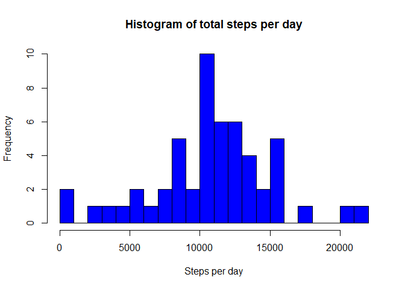
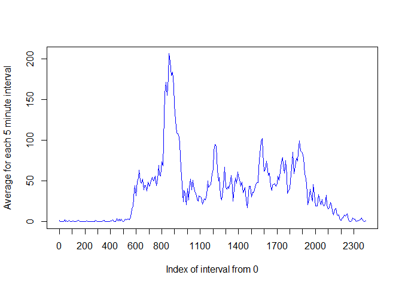
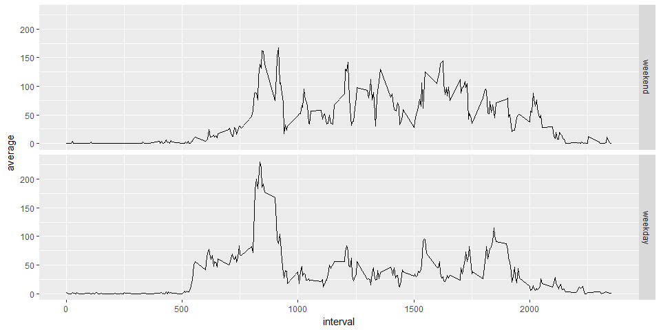

Reproducible Research Assignment 1
================

Introduction
------------

This assignment makes use of data from a personal activity monitoring device. This device collects data at 5 minute intervals throughout the day. The data consists of two months of data from an anonymous individual collected during the months of October and November, 2012 and include the number of steps taken in 5 minute intervals each day.

The aim of this work is to answer five questions:

1.  How do we load and preprocess the data?
2.  What is the mean total number of steps taken per day?
3.  What is the average daily activity pattern?
4.  How can we impute missing values in the data?
5.  Are there differences in activity patterns between weekdays and weekends?

### 1. How do we load and preprocess the data?

First, we load the packages we'll need for the processing later. The data has been imported to the working directory, so this won't include getting the file.

Next, we read in the data and correct the date format

### 2. What is the mean total number of steps taken per day?

At this stage, we can filter out the missing values - we'll look at them more closely in part 4. Will build a variable called dailysteps from dplyr, grouped by date.

``` r
  dailysteps <- data %>% 
  group_by(date) %>%
  summarise(total_steps=sum(steps,na.rm=TRUE),na=mean(is.na(steps))) 

  dailysteps <- filter(dailysteps, na < 1)
  hist(dailysteps$total_steps,col="blue",breaks=20,main="Histogram of total steps per day",xlab="Steps per day")
```



``` r
  mean_steps <- mean(dailysteps$total_steps,na.rm=TRUE)
  median_steps <- median(dailysteps$total_steps,na.rm=TRUE)
  
  mean_steps
```

    ## [1] 10766.19

``` r
  median_steps
```

    ## [1] 10765

``` r
(echo = TRUE)
```

    ## [1] TRUE

The mean number of steps per day is

``` r
  mean_steps
```

    ## [1] 10766.19

``` r
(echo = TRUE)
```

    ## [1] TRUE

...and the median number of steps is

``` r
  median_steps
```

    ## [1] 10765

``` r
(echo = TRUE)
```

    ## [1] TRUE

### 3. What is the average daily activity pattern?

``` r
library(dplyr,quietly = TRUE)
daily_patterns <- data %>% group_by(interval) %>% summarise(average=mean(steps,na.rm=TRUE))
plot(x = 1:nrow(daily_patterns),y = daily_patterns$average,type = "l",
    col = "blue", xaxt = "n",xlab="Index of interval from 0", 
    ylab = "Average for each 5 minute interval")
    axis(1,labels=daily_patterns$interval[seq(1,288,12)],
    at = seq_along(daily_patterns$interval)[seq(1,288,12)])
```



``` r
(echo = TRUE)
```

    ## [1] TRUE

``` r
max_numb_steps_interval <- filter(daily_patterns,average==max(average))
(echo = TRUE)
```

    ## [1] TRUE

Interval **"835"** contains the maximum number of steps (**206.17 steps**).

### 4. How can we impute missing values in the data?

#### 4.1. Calculate and report the total number of missing values in the dataset.

``` r
na_number <- sum(is.na(data$steps))
na_number
```

    ## [1] 2304

``` r
(echo = TRUE)
```

    ## [1] TRUE

There were **2304 ** missing values in the dataset.

#### 4.2. Devise a strategy for filling in all of the missing values in the dataset.

Each 5 minute interval with no values will have the values replaced with the mean number of steps for that time of day across all the populated data.

#### 4.3. Create a new dataset that is equal to the original dataset but with the missing data filled in.

Going through every record, looking for an NA, and replacing the NA in a new field, then show the header just to check that it worked.

``` r
without_NAs <- numeric(nrow(data))
for (i in 1:nrow(data))
{
        if (is.na(data[i,"steps"])==TRUE)
            {
                    without_NAs[i]<-filter(daily_patterns,interval==data[i,"interval"]) %>% select(average)
            } 
        else
            {
                    without_NAs[i]<-data[i,"steps"]
            }
                    
}
No_NAs<-mutate(data,steps_no_NAs=without_NAs)
head(No_NAs)
```

    ##   steps       date interval steps_no_NAs
    ## 1    NA 2012-10-01        0     1.716981
    ## 2    NA 2012-10-01        5    0.3396226
    ## 3    NA 2012-10-01       10    0.1320755
    ## 4    NA 2012-10-01       15    0.1509434
    ## 5    NA 2012-10-01       20    0.0754717
    ## 6    NA 2012-10-01       25      2.09434

``` r
(echo = TRUE)
```

    ## [1] TRUE

#### 4.4. Make a histogram of the total number of steps taken each day then calculate and report the mean and median total number of steps taken per day.

``` r
  steps_full <- No_NAs %>%
  filter(!is.na(steps)) %>%
  group_by(date) %>%
  summarize(steps = sum(steps)) %>%
  print()
```

    ## # A tibble: 53 x 2
    ##          date steps
    ##        <date> <dbl>
    ##  1 2012-10-02   126
    ##  2 2012-10-03 11352
    ##  3 2012-10-04 12116
    ##  4 2012-10-05 13294
    ##  5 2012-10-06 15420
    ##  6 2012-10-07 11015
    ##  7 2012-10-09 12811
    ##  8 2012-10-10  9900
    ##  9 2012-10-11 10304
    ## 10 2012-10-12 17382
    ## # ... with 43 more rows

``` r
  hist(steps_full$steps,col="red",breaks=20,main="Histogram of total steps per day corrected for missing values",xlab="Steps per day")
```


``` r
  mean_steps_full <- mean(steps_full$steps, na.rm = TRUE) 
  mean_steps_full
```

    ## [1] 10766.19

``` r
  median_steps_full <- median(steps_full$steps, na.rm = TRUE)
  median_steps_full
```

    ## [1] 10765

``` r
  (echo = TRUE)
```

    ## [1] TRUE

### 5. Are there differences in activity patterns between weekdays and weekends?

``` r
is_weekday <-function(date){
        if(wday(date)%in%c(1,7)) result<-"weekend"
        else
                result<-"weekday"
        result
}

without_NAs <- mutate(No_NAs,date=ymd(date)) %>% mutate(day=sapply(date,is_weekday))

table(without_NAs$day)
```

    ## 
    ## weekday weekend 
    ##   12960    4608

And finally...

``` r
daily_patterns <- without_NAs %>% mutate(day=factor(day,levels=c("weekend","weekday")),steps_no_NAs=as.numeric(steps_no_NAs)) %>% group_by(interval,day) %>% summarise(average=mean(steps_no_NAs))
qplot(interval,average,data=daily_patterns,geom="line",facets=day~.)
```

 There clearly appears to be less activity during the middle of the day during weekdays.
